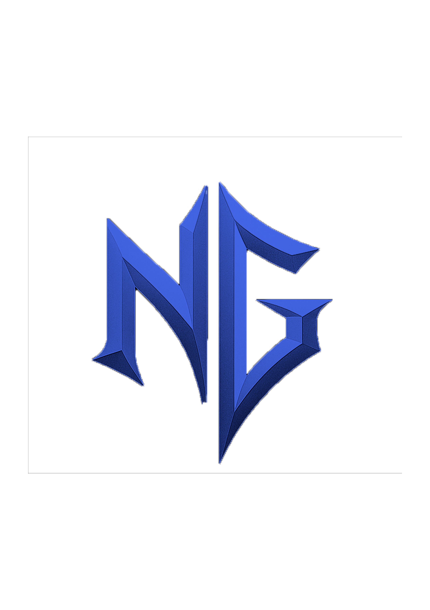

# 🎮 NextGen - Gaming E-Commerce Platform

<div align="center">



**A modern gaming e-commerce platform with real-time delivery tracking**

[](https://php.net)
[](https://mariadb.org)
[](https://developer.mozilla.org/en-US/docs/Web/JavaScript)
[](https://maplibre.org)

</div>

---

## 🚀 Overview

NextGen is a full-stack gaming e-commerce platform that allows users to browse, purchase, and track delivery of games. The platform features a modern gaming-themed UI with real-time GPS tracking for deliveries.

## ✨ Key Features

### 🛒 E-Commerce
- **Game Catalogue** - Browse games with video previews on hover
- **Category Filtering** - Filter by category, price range, and search
- **User Library** - View purchased games
- **Credits System** - In-platform currency for purchases

### 📦 Delivery System
- **Order Management** - Create and track delivery orders
- **Real-Time GPS Tracking** - Live map showing delivery progress
- **Admin Confirmation** - Deliveries start only after admin approval
- **Progress Visualization** - Step-by-step delivery status bar

### 👤 User Management
- **Authentication** - Secure login/registration
- **Profile Management** - Update profile and photo
- **Activity History** - Track all user actions

### 🎨 Modern UI/UX
- **Gaming Theme** - Purple/pink gradient design
- **Glassmorphism** - Frosted glass card effects
- **Animations** - Smooth transitions and hover effects
- **Responsive** - Works on all devices

---

## 🛠️ Tech Stack

| Layer | Technology |
|-------|------------|
| **Frontend** | HTML5, CSS3, JavaScript ES6+ |
| **Backend** | PHP 8.2 (MVC Architecture) |
| **Database** | MySQL / MariaDB |
| **Maps** | MapLibre GL JS, Leaflet, OSRM |
| **Styling** | Custom Design System, Tailwind CSS |
| **Icons** | Bootstrap Icons, Font Awesome |

---

## 📁 Project Structure

```
nextgen/
├── api/                    # REST API endpoints
├── config/                 # Configuration files
├── controller/             # MVC Controllers
├── models/                 # Data models
├── services/               # Business logic services
├── view/
│   ├── frontoffice/       # User-facing pages
│   ├── backoffice/        # Admin dashboard
│   ├── css/               # Design system
│   └── js/                # JavaScript components
├── games/                  # Playable HTML5 games
└── resources/              # Images, videos, assets
```

---

## 🎯 Core Modules

### 1. User Module
- Registration with email verification
- Secure password hashing
- Role-based access (User/Admin)
- Profile customization

### 2. Product Module
- Game CRUD operations
- Category management
- Image/video uploads
- Price management

### 3. Delivery Module
- Order creation with map picker
- Real-time GPS tracking via OSRM
- Admin delivery confirmation
- Automated status updates
- ETA calculations

---

## 🗺️ Real-Time Tracking Features

- **Interactive Map** - Click to select delivery destination
- **Route Visualization** - Shows actual road routes
- **Live Position Updates** - Truck marker moves in real-time
- **Progress Stats** - Distance, ETA, completion percentage
- **Fullscreen Mode** - Immersive tracking experience

---

## 🎮 Included Games

- 🐍 Snake
- ♟️ Chess Master
- 🎯 Copy Me
- 🚀 Asteroid Destroyer
- 🧠 Code Master
- 🧩 IQ Test
- 🔢 Memo Number
- 🏓 Pong

---

## 📸 Screenshots

### Homepage
Modern gaming-themed landing page with animated hero section

### Catalogue
Game grid with video preview on hover, filtering, and search

### Delivery Tracking
Real-time GPS map with route visualization and progress bar

### Admin Dashboard
Complete management panel for users, games, and deliveries

---

## 🚀 Getting Started

### Option 1: Docker (Recommended) 🐳

**Prerequisites:** Docker Desktop installed

```bash
# Clone the repository
git clone [repository-url] nextgen
cd nextgen

# Start all services
docker-compose up -d

# Wait for MySQL to initialize (first run takes ~30 seconds)
docker-compose logs -f db
```

**Access:**
- 🌐 App: http://localhost:8080/view/frontoffice/index.php
- 🗄️ phpMyAdmin: http://localhost:8081

**Stop services:**
```bash
docker-compose down
```

### Option 2: XAMPP (Traditional)

**Prerequisites:**
- XAMPP (Apache + MySQL)
- PHP 8.0+

**Steps:**
1. Clone to `htdocs`:
```bash
cd C:\xampp\htdocs
git clone [repository-url] nextgen
```

2. Import database:
- Open phpMyAdmin (http://localhost/phpmyadmin)
- Create database `nextgen_db`
- Import `nextgen_db (6).sql`

3. Start XAMPP:
- Start Apache
- Start MySQL

4. Access:
```
http://localhost/nextgen/view/frontoffice/index.php
```

---

## 👨‍💻 Author

**Dhia Boulares**

---

## 📄 License

This project is for educational purposes.

---

<div align="center">

**Built with ❤️ and lots of ☕**

</div>
