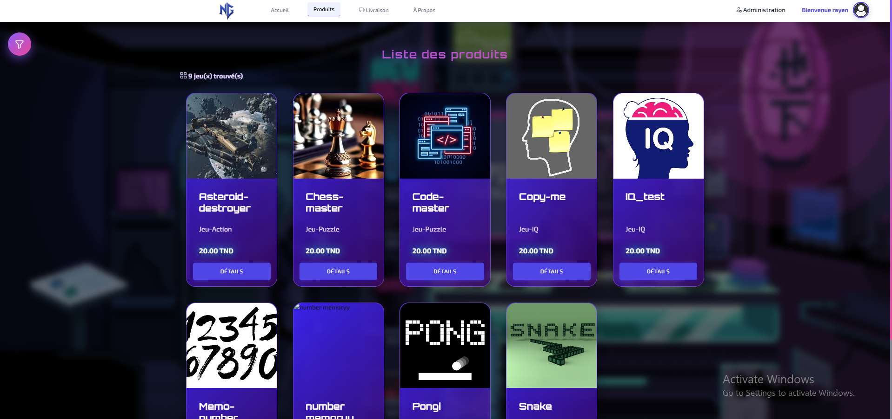
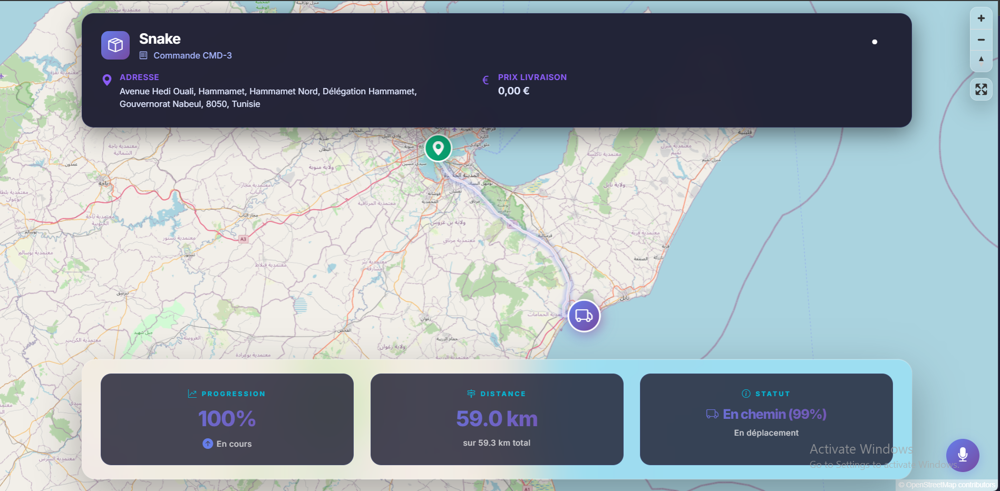
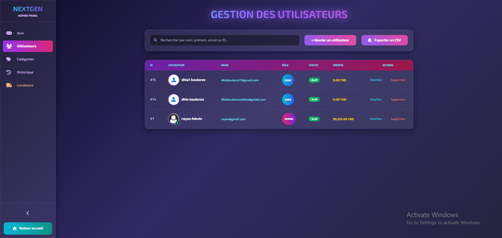
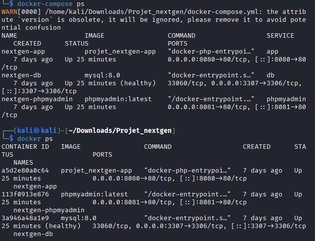
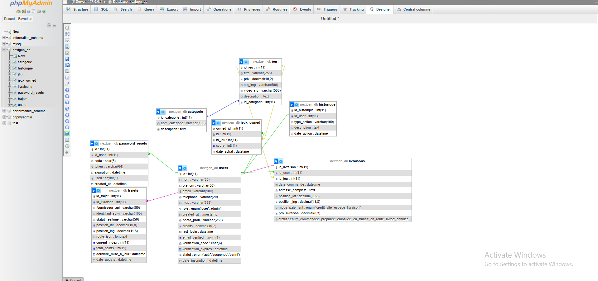

<p align="center">
  
</p>

<h1 align="center">🎮 NextGen Gaming Platform</h1>

<p align="center">
  <strong>A full-stack gaming e-commerce platform with real-time delivery tracking</strong>
</p>

<p align="center">
  
  
  
  
</p>

---

## 📸 Screenshots

### 🏠 Homepage


### 🎯 Game Catalogue


### 🚚 Real-Time Delivery Tracking


### �‍d💼 Admin Dashboard


---

## � DevOAps & Deployment

### Docker Containers Running


### Deployed on Linux VM (Kali)


### Database Management (phpMyAdmin)


---

## ✨ Features

| Feature | Description |
|---------|-------------|
| 🛒 **E-Commerce** | Game catalogue, categories, purchase system |
| 👤 **User System** | Authentication, profiles, game library |
| 🚚 **Delivery Tracking** | Real-time map tracking with status updates |
| 👨‍💼 **Admin Panel** | Full CRUD for users, games, categories, deliveries |
| 🎨 **Modern UI** | Responsive gaming-themed design |
| 🐳 **Dockerized** | One-command deployment with Docker Compose |
| 🔄 **CI/CD** | Automated testing and builds with GitHub Actions |

---

## �️ Tecch Stack

<table>
<tr>
<td align="center"><br/>PHP 8.2</td>
<td align="center"><br/>MySQL</td>
<td align="center"><br/>Docker</td>
<td align="center"><br/>Apache</td>
<td align="center"><br/>JavaScript</td>
</tr>
</table>

---

## 🚀 Quick Start

### Option 1: Docker (Recommended)

```bash
# Clone the repository
git clone https://github.com/rayenouerghui/Projet_nextgen.git
cd Projet_nextgen

# Start all services
docker-compose up -d

# Access the application
# 🌐 App:        http://localhost:8080
# 🗄️ phpMyAdmin: http://localhost:8081
```

### Option 2: XAMPP

1. Clone to `C:\xampp\htdocs\`
2. Import `database.sql` into MySQL
3. Start Apache & MySQL
4. Visit `http://localhost/Projet_nextgen`

---

## 📁 Project Structure

```
Projet_nextgen/
├── 📂 api/              # REST API endpoints
├── 📂 config/           # Database configuration
├── 📂 controller/       # MVC Controllers
├── 📂 models/           # Data models
├── �D view/
│   ├── frontoffice/     # User pages
│   ├── backoffice/      # Admin pages
│   ├── css/             # Stylesheets
│   └── js/              # JavaScript
├── 📂 games/            # Mini-games collection
├── 📂 resources/        # Media uploads
├── 📂 scripts/          # Deployment scripts
├── 🐳 docker-compose.yml
├── 🐳 Dockerfile
└── �️ rdatabase.sql
```

---

## 🐳 Docker Services

| Service | Port | Description |
|---------|------|-------------|
| `nextgen-app` | 8080 | PHP Application |
| `nextgen-db` | 3307 | MySQL Database |
| `nextgen-phpmyadmin` | 8081 | Database Admin UI |

---

## 📜 Deployment Scripts

```bash
./scripts/install-docker.sh  # Install Docker on Debian/Kali
./scripts/deploy.sh          # Build and start containers
./scripts/status.sh          # Check container status
./scripts/logs.sh            # View application logs
./scripts/stop.sh            # Stop all containers
```

---

## 🔄 CI/CD Pipeline

The project includes a GitHub Actions workflow that:

1. ✅ Runs PHP syntax checks on every push
2. 🐳 Builds Docker image
3. 📦 Pushes to Docker Hub (when configured)
4. 📢 Notifies when deployment is ready

---

## 👤 Author

<table>
<tr>
<td align="center">
<strong>Rayen Ouerghui</strong><br/>
<a href="https://github.com/rayenouerghui">@rayenouerghui</a>
</td>
</tr>
</table>

---

## 📄 License

This project is licensed under the MIT License.

---

<p align="center">
  <strong>⭐ Star this repo if you found it useful!</strong>
</p>
